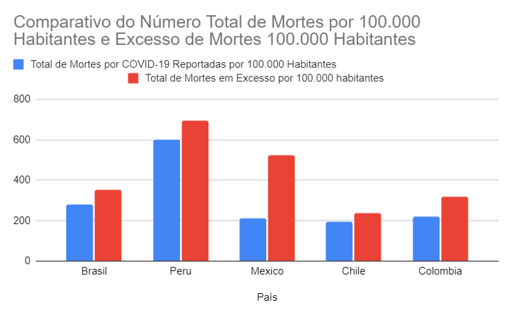

# Projeto 1 - Excesso de mortes por Covid-19 na América Latina

🔗<a href="https://docs.google.com/spreadsheets/d/1Qpu0r7nzgTG9E52ABfz2TVqvFua58IFw24cWOyozq0w/edit?usp=sharing">Projeto Completo</a>

Este projeto foi realizado como pré-requisito para ingressar no Bootcamp de Certificação em Análise de Dados da Laboratória em parceria com a IBM.

## Sobre o Projeto

Utilizando planilhas de um conjunto de dados sobre óbitos por COVID-19 em 5 países da América Latina, o objetivo deste projeto foi analisar os dados e determinar(considerando os valores por 100.000 habitantes):
- Em que país há a maior diferença entre os óbitos oficiais de COVID notificados e os excedentes estimados de óbitos?
- Em que país existe a menor diferença entre os óbitos oficiais por COVID notificados e os excedentes estimados de óbitos?
- Qual é o país com o maior número de óbitos excedentes?

## Sobre o dataset
O dataset foi disponibilizado pela equipe da Laboratoria, e é composto das seguintes colunas:
- país: nome do país (podem ser: México, Peru, Chile, Brasil e Colômbia)
- data de início: data de início do intervalo de contagem de mortes
- data de término: data de término do intervalo de contagem de mortes
- dias: número de dias da contagem de óbitos. No caso do Chile, Peru, Colômbia e México é uma semana (7 dias). Para o Brasil, os dados são acumulados mensalmente (28, 30 e 31 dias).
- semana: número da semana ou mês do ano.
- total de mortes relatadas: é o total de óbitos notificados por qualquer causa (não apenas COVID-19) no intervalo de datas estabelecido (óbitos em uma semana ou mês).
- total de mortes relatadas por COVID-19: é o total de óbitos notificados causados ​​por COVID-19 no intervalo de datas estabelecido (óbitos em uma semana ou mês)

Outras colunas geradas para realizar a análise dos dados:
- total mortes covid por 100000 habitantes: (Nº de mortes em um determinado período x  100.000 habitantes)/ Nº de habitantes do país
- total mortes covid acumuladas por 100000 habitantes: total mortes por covid por 100000 habitantes até a semana anterior somado ao total mortes por covid por 100000 habitantes da semana atual;
- total de mortes (prognóstico): previsão de mortes (foi calculado utilizando média aritmética simples da quantidade de mortes no mesmo intervalo de tempo em período pré-pandêmico);
- excesso de mortes(por covid): a diferença entre o total de mortes notificadas e o prognóstico de mortes;
- excesso de mortes(por covid) por 100000 habitantes: (Excesso de mortes em um determinado período x  100.000 habitantes)/ Nº de habitantes do país
- excesso de mortes(por covid) acumuladas por 100000 habitantes: excesso de mortes por covid por 100000 habitantes até a semana anterior somado ao excesso mortes por covid por 100000 habitantes da semana atual.

## Ferramentas utilizadas
- Planilhas Google

## Aprendizados
- Manipular e organizar dados em planilhas

## Análise 

Através dos <a href="https://docs.google.com/spreadsheets/d/1Qpu0r7nzgTG9E52ABfz2TVqvFua58IFw24cWOyozq0w/edit?usp=sharing">dados analisados </a> pode-se concluir que durante o período observado:
- O **México** é o país com a maior diferença entre os óbitos oficiais e os excedentes estimados;
- O **Chile** é o país com a menor diferença entre os óbitos oficiais e os excedentes estimados;
- E o **Peru** é o país com o maior número de óbitos excedentes.

